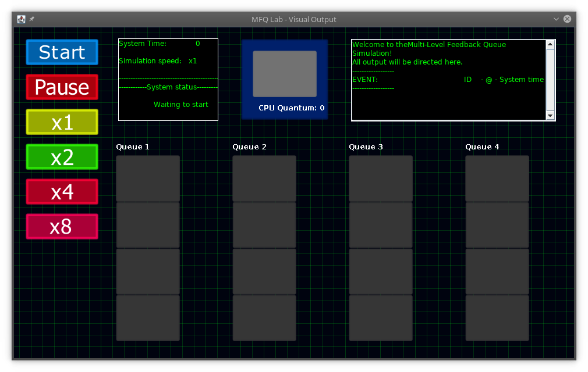
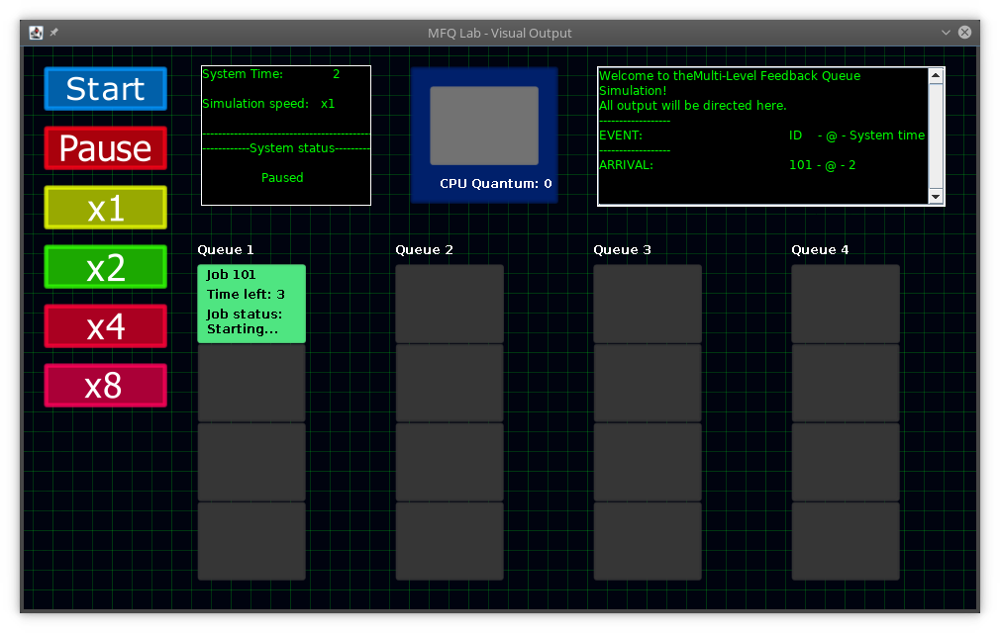
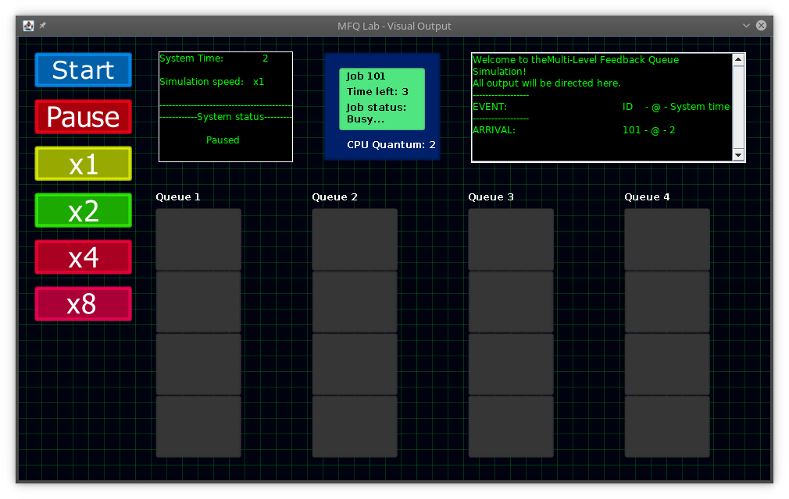
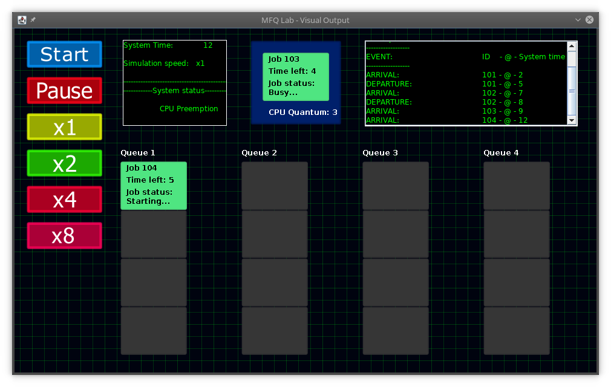
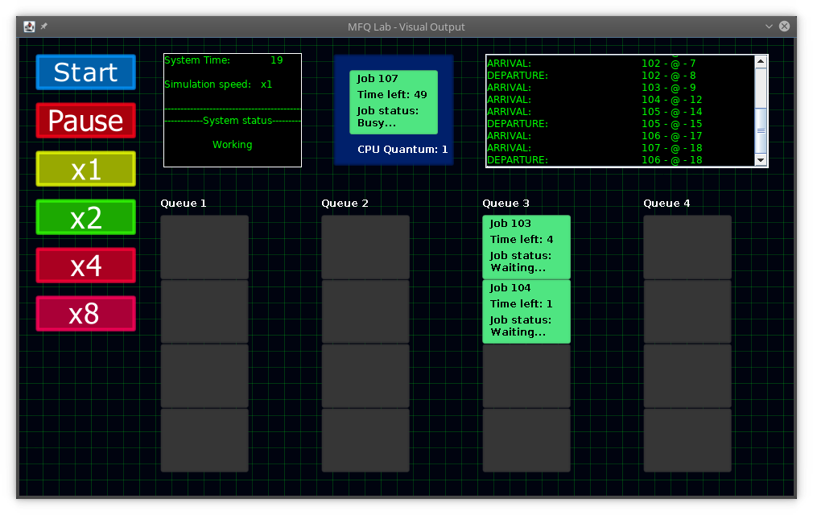
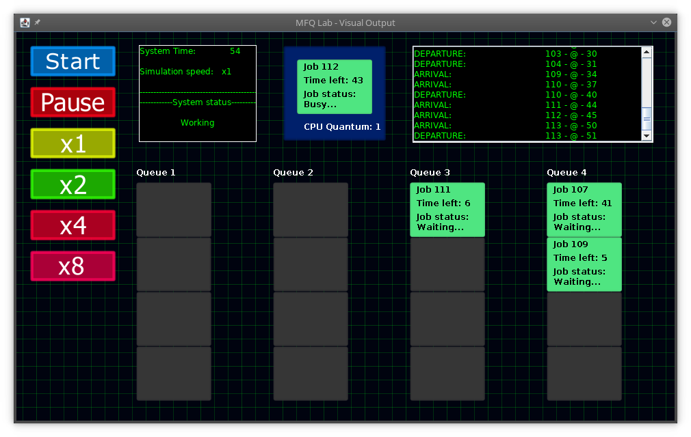
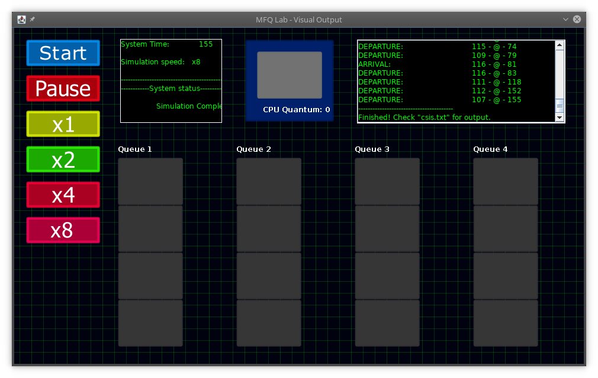

# Multilevel Feedback Queue Simulation

This repository is more or less an archive for this project. This is here mainly just for my own reference, but is open for everyone to examine at leisure. I highly do not recommend using any of the code, as it is largely messy, but it can be used to learn a few things, if needed.

Feel free to download this and use as a basic visual simulator for one approach to the MFQ concept. To run from the terminal, use

```bash
java -cp bin/ Driver
```

in the source directory.

## Project Information

As the title suggests, this is a simulation of a multilevel feedback queue as if it were in a CPU. The purpose is to show how a queue can be used and how a basic CPU scheduler may utilize the data structure. This simulation contains four queues to represent their priority in the scheduler, with the final queue being the lowest priority. Jobs that come into the scheduler will be placed at the top and move down as they are preempted by the CPU for taking too much time or by a job with higher priority coming into the system. In the final queue, the jobs will simply loop round-robin style until they are finished.

The program runs both on the terminal and GUI, but the GUI will not work if the images files are missing.

Because this is an archive of an older project, issues regarding the function of the program still exist and will not be fixed. Some of those include:

- The UI is not adjustable and has a fixed size.
  - The text is also inconsistent between platforms, likely due to font differences. As seen in the screenshots, some text may be truncated if not on Windows. (screenshots were taken in Linux)
  - The design is not the greatest either. It does its job, but certainly is not the nicest looking program.
- Jobs that are scheduled to come in at the same time will break the scheduler.
- The animation of the graphics are written using the sleep function.
- Additionally, the graphical entities are handled using Java's GUI libraries. While it works, it is not ideal. There are much better ways to handle the graphics and implementations. It was done mostly in effort to not have to use any external graphical libraries.
- A non-fatal exception is occasionally thrown, presumably because the graphics thread and the main thread are attempting to access certain arraylists simultaneously.
- No ability to restart. The only way to restart is to close the program and start it up again.
- One of the calculations at the end contains an error


## Screenshots














